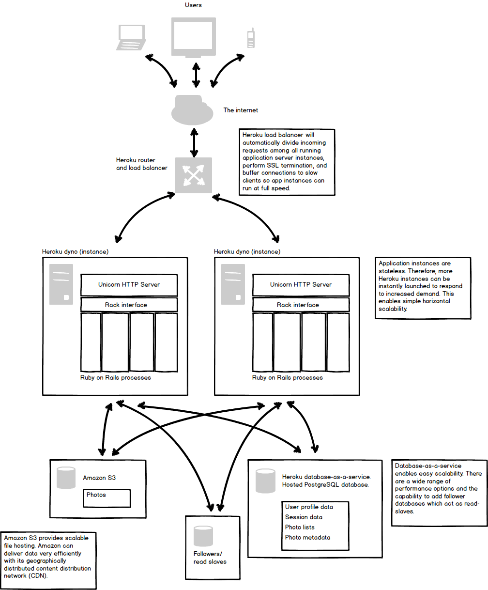

First Report (Use case, architecture, wireframes)
=================================================

Date: 10/12/2014

Jacob Ward, Jacob Pruitt, Nathan Flick

Use Case Diagram
================

Architecture
============

Monet is a scalable image storage and editing service.
It utilizes open-source components to simplify development as much as possible.
It is designed to be deployed using Heroku, which offers easy deployment and quick horizontal scaling.

## OSS Components

### Ruby on Rails
[Ruby on Rails](http://rubyonrails.org/) is a web application framework for the Ruby language.
Rails is designed to automatically perform or simplify many of the common tasks in a web application.
Rails handles dispatching of urls to different handlers, rendering templated HTML, simplifying database access, and much more.
Rails uses the model-view-controller (MVC) pattern and the active record pattern, and emphasizes convention over configuration (CoC) and don't repeat yourself (DRY).

Ruby on Rails was chosen because it is one of the most widely used and highly recognized web application frameworks in existance.
Rails is the framework that inspired many others, and it has set the standard in this area.
Rails has a remarkable number of add-on modules and also works very well with deployment on the Heroku hosting service.

Ruby on Rails is licensed under the [MIT license](http://opensource.org/licenses/MIT).
The Ruby programming language and its standard implementation are licensed under the [Ruby license](https://www.ruby-lang.org/en/about/license.txt).
These licenses are permissive and permit Ruby on Rails to be used for both commercial and non-commercial work.

### Unicorn
[Unicorn](http://unicorn.bogomips.org/) is an HTTP server for Ruby.
It interfaces with application frameworks using the [Rack](http://rack.github.io/) specification.
Unicorn has the capability to launch worker processes to process incoming requests, divide requests among workers, and restart workers that time out.
Unicorn will permit Rails to efficiently serve HTTP requests.

Unicorn was chosen because Rails is not by itself an HTTP server, just an application framework.
Although Rails includes a server, it is just a development server not intended for production purposes.
For Rails to function efficiently, it needs to be running behind a full web server that can handle concurrent requests.
This is the role of Unicorn.

Unicorn is licensed under [GPLv2](http://www.gnu.org/licenses/gpl-2.0.html).

### Clearance
[Clearance](https://github.com/thoughtbot/clearance) is a simple authentication module for Rails.
Clearance stores user's credentials securely in the data store, it allows users to authenticate themselves, and it maintains user sessions.
It also includes support for resetting passwords via emails.

There are many authentication modules available for Rails, but Clearance is one of the simplest.
It will give us the capabilities we need without adding unnecessary complication.

Clearance is licensed under the [MIT license](http://opensource.org/licenses/MIT).

### CamanJS
[CamanJS](http://camanjs.com/) is a Javascript library for manipulating images in the browser.
Moving image manipulation to the browser directly will allow us to make changes more responsive to the user because the page will not need to be refreshed.
It will also reduce the load on our servers.

We chose CamanJS because it was the most mature of the Javascript image manipulation libraries that we looked at.

CamanJS is licensed under a [custom license](https://github.com/meltingice/CamanJS/blob/master/LICENSE) that permits it to be used for both non-commercial and commercial purposes.

## Hosting Services

### Heroku
[Heroku](http://www.heroku.com) is a cloud hosting service that defines itself by integrating with git and providing quick scalability.
Deploying to Heroku is as simple as pushing to a special git repository hosted on Heroku.
Heroku then builds your code and all of its dependencies into an image that is ready to be deployed to any number of instances (dynos in Heroku-speak).
Instances are virtualized Unix hosts that run the image Heroku has generated.
Instances are stateless and can be quickly launched and torn down to meet demand.

We chose Heroku over other cloud hosting services because it is simple and sleek.
Putting our application in the cloud will be as simple as pushing to a git repository and making a few clicks to launch instances.
Jake Pruitt also had prior experience with Heroku.

### Heroku Load Balancing
Heroku's infrastructure takes care of load balancing.
It automatically divides incoming requests between the running instances, spreading the load equally across them.
Heroku can also take care of SSL termination.

Load balancing is a fundamental part of the Heroku infrastructure, so there is no need to do anything ourselves.

### Heroku database-as-a-service
Heroku provides [database-as-a-service](https://www.heroku.com/postgres) services, which is a hosted PostgreSQL instance that your application servers can connect to.
They offer many performance levels for scalability.
You can choose database sizes anywhere from 1GB to 1TB, up to 120 GB of RAM, and up to 500 simultaneous connections.
These databases can be accessed from anyway, so you can run a development server on your local machine against a database in the cloud.
They offer easy replication so that application servers can divide the load among multiple database servers.
These are PostgreSQL relational databases, and will be used for profile data, session data, photo lists and photo metadata.
The photos themselves will be stored in Amazon S3.

Since the application instances are stateless and can be launched or torn down at any moment, you can't store persistent data on them.
For this reason, apps hosted on Heroku have to use Heroku's services for data storage.

### Amazon S3
[Amazon S3](http://aws.amazon.com/s3/) provides data hosting services that can handle the huge amount of data that a scalable image storage application will generate.
Using Amazon S3 will reduce the load on our servers by directing the heavy image traffic directly to Amazon itself.
Amazon will be able to serve this content more efficiently that our Heroku instances could thanks to Amazons geographically distributed content delivery network (CDN).

We choose Amazon S3 because it is a well-known and scalable way to store files.
Storing this data in Amazon S3 will be much more effective than attempting to store it in a relational database.
It will also reduce the cost of our Heroku hosting by reducing the load on the Heroku instances.

## Development Services

### Github
[Github](http://www.github.com) is a web viewer and frontend to the git source control management system.
It makes it very easy for a group to collaborate on a project using git.
Features offered by Github include pull requests, which visualize all of the info related to a potential change in the code; issues, which marks bugs that need to be fixed or features that need to be developed; and many more.

Since deploying on Heroku requires our code to be in git, using Github is an obvious choice.

### Travis CI
Travis CI is a free continuous integration service for open-source projects.
It integrates with Github and will allow unit tests to be run on any pull request or commit.
This will prevent us from unwittingly committing code which breaks something.

## Diagram

Wireframes
==========

Main Pre-Login Page
-------------------

Register Page
-------------

Main Listing Page
-----------------

Edit Account Page
-----------------

Image Upload Page
-----------------

Image Detail Page
-----------------

Image Edit Page
---------------

